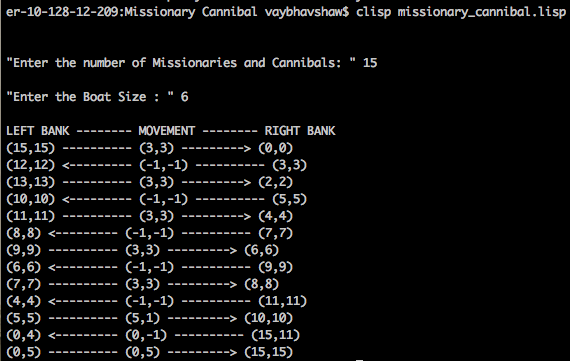

# Missionary Cannibal Problem Solver
Artificially Intelligent Code to solve the Missionary Cannibal problem using LISP

## Problem Definition
Lisp code that solves the missionaries and cannibals problem assuming that we have
one boat, and M cannibals and M missionaries on left bank of the river. Take the user input for the boat size and there is a single boat available. You cannot also have the boat moving with no one onboard. The cannibals should never outnumber the missionaries (either on the boat or at both sides of the river). How would you send all the missionaries and cannibals on the right bank of the river.

## Approach Taken
1. Take the input of the number of missionaries and cannibals on the left bank 
2. Take the input of the boat size from the user
3. Define the current state : (a b c)
	a. index 0 : number of missionaries on left bank
	b. index 1 : number of cannibals on left bank
	c. index 2 : 0 if position of the boat is left bank and 1 if position of the boat is right bank
4. Define the goal state as (0 0 0) : 0 missionaries and cannibals on the left bank 
5. Define closed-list : Store all the traversed states to avoid loops
6. Define open-list : stores the available moves/states that the boat can take 
7. Run an infinite loop which terminates when the (current-state = goal-state)
	a. Generate all states from the current-state depending on the boat size
	b. Find all the untraversed generated states that are valid, and push them into open-list 
	c. Sort the open-list and pop the state which helps in maintaining maximum number of missionaries and cannibals on the right bank 
	d. Push the new-child into closed-list
	e. Check if the (new-child = goal-state)
		i ) if no -> go back to step 7 and start the iteration again with the new-child state
		ii) if yes -> exit the loop
9. Reverse the closed-list, to access the traversed states in the correct order 
10 Pop each node form the closed-list and print the sequence of steps
## Output 

